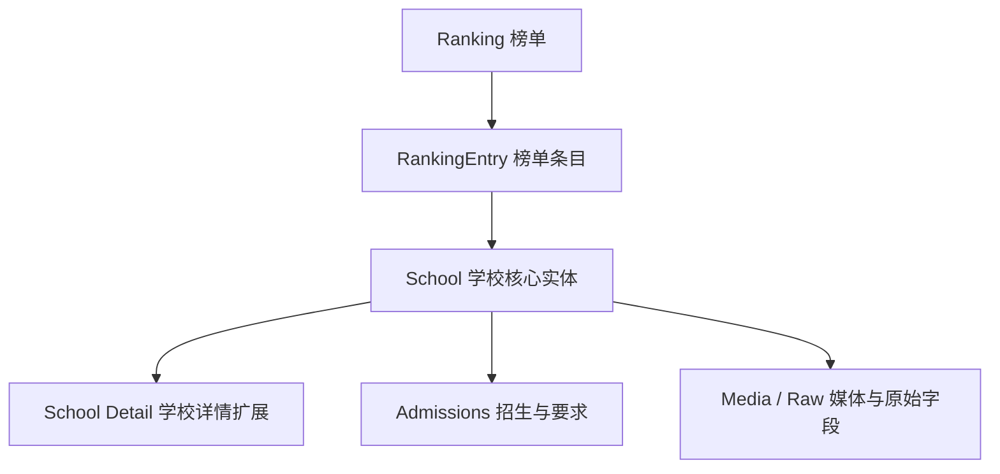

# AdmitRanking Data Structure

AdmitRanking is best understood as a school-centric data source.  
中文理解：翠鹿本质上更像“以学校为核心对象的数据源”，不是纯榜单站。

## High-Level Model

## Mental Model

- `Ranking`: a ranking itself  
  中文：榜单本身，例如“翠鹿最佳公立国际部排名”
- `RankingEntry`: one school's position inside a ranking  
  中文：某学校在某个榜单中的一条记录
- `School`: the school as the main entity  
  中文：学校本身，是最核心的对象
- `School Detail`: richer school-level information  
  中文：学校详情页里的扩展信息

So the clean model is:  
中文可以直接记成：

`Ranking -> RankingEntry -> School -> School Detail`

## Layer 1: Ranking

Represents a ranking itself.  
中文：表示一个榜单实体。

Typical raw fields:

- `id`
- `title`
- `etitle` / `titleEn`
- `year`

Questions it answers:

- What rankings are available?  
  中文：现在有哪些榜单？
- What does ranking `52` mean?  
  中文：`52` 这个榜单是什么？

## Layer 2: RankingEntry

Represents one school's position inside a ranking.  
中文：表示某所学校在某榜单里的那一条名次记录。

Typical raw fields:

- `id` -> actually school id / `comId`
- `rank`
- `rankTitle`
- `rankName`
- `curriculumLabels`

Suggested normalized fields:

- `rankingId`
- `entityId`
- `rank`
- `labels`

Questions it answers:

- Which schools appear in ranking `52`?  
  中文：榜单 `52` 里有哪些学校？
- What rank does school `103` have there?  
  中文：学校 `103` 在这个榜单里排第几？

## Layer 3: School

Represents the school as the main entity.  
中文：学校是核心主实体。

Typical raw fields:

- `id`
- `title`
- `titleEn`
- `countryName`
- `provinceName`
- `cityName`
- `gradeStart`
- `gradeEnd`
- `curriculumLabels`
- `typeTitle`
- `labels`
- `lableList`

Suggested normalized fields:

- `id`
- `name`
- `nameEn`
- `country`
- `province`
- `city`
- `gradeStart`
- `gradeEnd`
- `gradeRange`
- `curricula`
- `tags`

Questions it answers:

- What is school `90`?  
  中文：`90` 这所学校本身是什么？
- Where is it located?  
  中文：它在哪个国家 / 城市？
- Which curricula does it offer?  
  中文：它提供什么课程体系？

## Layer 4: School Detail

Represents richer school-level information.  
中文：这是学校详情页里更深一层的信息。

Typical raw fields:

- `website`
- `email`
- `telPhone`
- `address`
- `charge`
- `startCharge`
- `endCharge`
- `boardTypeStr`
- `isBoarding`
- `isPublic`
- `service`
- `comTypeTitle`

These are useful, but should not all become default CLI output immediately.  
中文：这些字段很有价值，但不一定要立刻全部变成 CLI 默认输出。

## Layer 5: Admissions / Requirements

Represents admissions and enrollment-related information.  
中文：表示招生、入学、身份要求等信息。

Typical raw fields:

- `apply`
- `apply.nationalReq`
- `apply.householdReq`
- `apply.hasExamination`
- `apply.hasInterview`
- `apply.enrollmentType`
- `extendAttr.countryRequirements`
- `extendAttr.curriculumSystem`

Interpretation:

- provider-specific and high-value  
  中文：价值很高，但 provider 特征也很强
- better to keep raw-first before over-normalizing  
  中文：先 raw 保留，比一开始过度标准化更稳

## Layer 6: Quality / Signals

Represents ratings, transparency, and participation signals.  
中文：表示评分、透明度、评价活跃度等信号。

Typical raw fields:

- `rank`
- `judgeCount`
- `dataTransparencyInt`
- `dataAcademicRes`
- `dataSchoolHonors`
- `dataUpResult`
- `scoreList`

Suggested keep-now fields:

- `stats.rank`
- `stats.judgeCount`
- `stats.transparency`

Keep raw for later:

- `scoreList`
- `dataAcademicRes`
- `dataSchoolHonors`
- `dataUpResult`

## Layer 7: Media / Attachments / Raw

Represents content-heavy provider-specific data.  
中文：这是偏内容型、媒体型、原始型的字段层。

Typical raw fields:

- `coverPic`
- `logo`
- `medias`
- `attachments`
- `introduce`
- `rankConfigs`

Interpretation:

- valuable for future exports, profiles, and AI summarization  
  中文：以后做导出、学校画像、AI 摘要会很有价值
- not ideal as default terminal output  
  中文：但不适合直接作为默认 CLI 输出

## Keep / Later / Raw

### Keep in the core normalized model now

- `id`
- `title` / `titleEn`
- `countryName`
- `provinceName`
- `cityName`
- `gradeStart`
- `gradeEnd`
- `curriculumLabels`
- `rank`
- `judgeCount`
- `dataTransparencyInt`

中文：这些是现在就值得进入核心标准模型的字段。

### Keep raw-first for now

- `typeTitle`
- `comTypeTitle`
- `service`
- `charge`
- `apply`
- `extendAttr`
- `scoreList`
- `introduce`
- `medias`
- `attachments`

中文：这些字段先 raw 保留，后面再决定怎么标准化最稳。

## Practical Conclusion

AdmitRanking is not just:

`ranking -> some school info`

It is closer to:

`school core entity + ranking organization layer + admissions/detail extensions`

中文总结：

翠鹿不是“榜单下面顺带带点学校信息”，而是“学校是核心实体，榜单是学校的一种组织和展示方式”。
